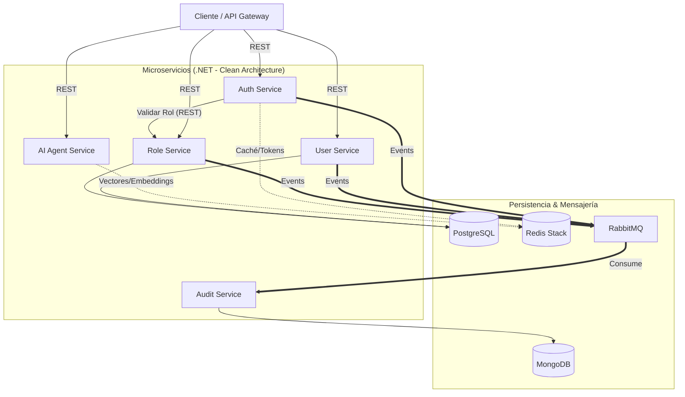

# Diseño y Arquitectura de Software

# Sistema de Gestión de Usuarios y Auditoría con IA (SmartUsers)

Este documento contiene el diseño arquitectónico para un sistema de gestión de usuarios. Este sistema permite autenticación, autorización, auditoría de accesos y cuenta con un módulo de Inteligencia Artificial para consultas avanzadas.

---

## 1. Diagrama de Arquitectura

El siguiente diagrama muestra la interacción entre los microservicios, el API Gateway o cliente, las bases de datos y el bus de eventos.



---

## 2. Justificación de Decisiones Técnicas

- **Sistema de microservicios en .NET:**
  - Elegí .NET porque ofrece un ecosistema de desarrollo muy avanzado que facilita la integración de diversas tecnologias (librerías) modernas con una alta eficiencia. Además, es el ecositema con el que tengo mayor experiencia en desarrollo de aplicaciones.
- **Estrategia Multi-DB:**
  - **PostgreSQL:** La utilizo en los procesos de `User Service` y `Role Service` por su fuerte estabilidad y excelente manejo de relaciones estructurales.
  - **MongoDB:** Esta base de datos es utilizada por `Audit Service`. Se eligió debido a que los logs de auditoría son documentos que pueden variar en estructura y nos permite agregar campos nuevos al documento según sea necesario en un futuro. Además los logs requieren alta velocidad de escritura.
  - **Redis Stack:** Cumple una doble función. Se utiliza como caché de alta velocidad para invalidación de tokens en el `Auth Service`. También es muy necesaria como **Base de Datos Vectorial** para el módulo de IA.
  - **Mensajería con RabbitMQ:** Se utiliza para la mensajeria asincrona permitiendo que los servicios se manden mensajes entre sí sin tener que esperar una respuesta inmediata.

---

## 3. Flujo de Datos entre Microservicios

1. **Flujo Síncrono (Autenticación):** El cliente envía credenciales al `Auth Service`. Este servicio consulta a PostgreSQL para validar el usuario y hace una petición REST al `Role Service` para obtener los permisos. Finalmente, devuelve un token y guarda el estado en Redis. Esto con el fin de poder validar de forma rápida si el token sigue activo en las consultas.
2. **Flujo Asíncrono (Auditoría):** Cuando ocurre una acción importante como un inicio de sesión fallido, el microservicio de origen publica un evento en RabbitMQ. El `Audit Service`, de forma independiente, consume este mensaje y lo guarda en MongoDB sin bloquear la respuesta al usuario, agilizando el flujo del llamado.
3. **Flujo RAG (IA):** El usuario hace una pregunta en lenguaje natural al `AI Agent Service`. El servicio convierte la pregunta en un vector, busca similitudes semánticas en Redis Stack donde están indexados los logs de auditoría y envía ese contexto a nuestro modelos de IA para generar una respuesta precisa.

---

## 4. Principios de DDD y Clean Architecture

Cada microservicio está diseñado internamente de forma independiente siguiendo **Clean Architecture**, asegurando que las reglas del negocio no dependan de frameworks externos:

- **Domain Layer:** Esta capa contiene las entidades y las interfaces. Aplicando **Domain-Driven Design (DDD)**, definimos _Bounded Contexts_ estrictos. Por ejemplo, el `UserService` es dueño del _Aggregate_ `User` con su nombre, email, telefono, etc., mientras que el `RoleService` gestiona el contexto de autorizaciones sin acoplarse a los datos personales.
- **Application Layer:** Contiene los casos de uso implementados con el patrón CQRS, coordinando la lógica sin saber de qué base de datos vienen los datos.
- **Infrastructure Layer:** Implementa las interfaces del dominio como repositorios con Entity Framework Core o el cliente de MongoDB.
- **Presentation Layer:** Es excluisva para los controladores REST.

---

## 5. Orquestación con Docker Compose

El sistema está diseñado para levantarse localmente de forma autocontenida. A continuación, la estructura base del `docker-compose.yml` que orquesta tanto la infraestructura como las APIs:

```yaml
version: "3.8"

services:
  # --- INFRAESTRUCTURA ---
  postgres-db:
    image: postgres:15-alpine
    ports: ["5432:5432"]
    networks: ["microservices-net"]

  mongodb:
    image: mongo:latest
    ports: ["27017:27017"]
    networks: ["microservices-net"]

  redis:
    image: redis/redis-stack:latest
    ports: ["6379:6379", "8001:8001"]
    networks: ["microservices-net"]

  rabbitmq:
    image: rabbitmq:3-management-alpine
    ports: ["5672:5672", "15672:15672"]
    networks: ["microservices-net"]

  # --- MICROSERVICIOS ---
  auth-api:
    build: { context: ., dockerfile: src/AuthService/Auth.API/Dockerfile }
    depends_on: [postgres-db, redis]
    networks: ["microservices-net"]

  user-api:
    build: { context: ., dockerfile: src/UserService/User.API/Dockerfile }
    depends_on: [postgres-db, rabbitmq]
    networks: ["microservices-net"]

  role-api:
    build: { context: ., dockerfile: src/RoleService/Role.API/Dockerfile }
    depends_on: [postgres-db, rabbitmq]
    networks: ["microservices-net"]

  audit-api:
    build: { context: ., dockerfile: src/AuditService/Audit.API/Dockerfile }
    depends_on: [mongodb, rabbitmq]
    networks: ["microservices-net"]

  ai-agent-api:
    build: { context: ., dockerfile: src/AIService/AI.API/Dockerfile }
    depends_on: [redis]
    networks: ["microservices-net"]

networks:
  microservices-net:
    driver: bridge
```

# Autor: Daniel Camacho
